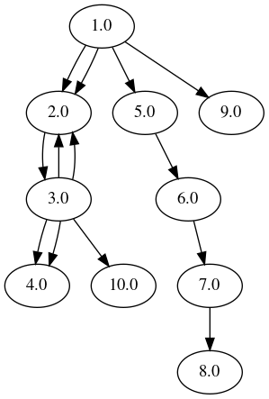

# pdfobjflow3-python3

Taken from <https://bitbucket.org/sebastiendamaye/pdfobjflow/src/master/>, which is Python2 code that does not work with Python 3.

Graph of [malware PDF output from pdf-parser](/data/example_malware_pdf_output.txt) (SAFE TO CLICK!):

## Requirements

- Python 3
- See `Pipfile`
- Make sure graphviz is installed.

## Using as a CLI tool

Too lazy to package in PyPI.

Clone the repo and add it to your System PATH variable!

## Testing

`cat ./data/example_malware_pdf_output.txt | ./pdfobjflow3.py`
    
Note: The below example requires pdf-parser.
<https://blog.didierstevens.com/programs/pdf-tools/>
    
`pdf-parser data/sample.pdf | pdfobjflow3`
    
`./pdfobjflow3.py --inputfile ./data/example_malware_pdf_output.txt`
        

`./pdfobjflow3.py --inputfile ./data/example_malware_pdf_output.txt --outputfilename cool_output --outputfolder out/test`

## Notes from original dev

> This program is meant to be used with pdf-parser from Didier Stevens. It reads the output from pdf-parser and creates the map of the objects flows under the form of a DOT file. You can then use the dot utility to export an image (e.g. PNG file).
